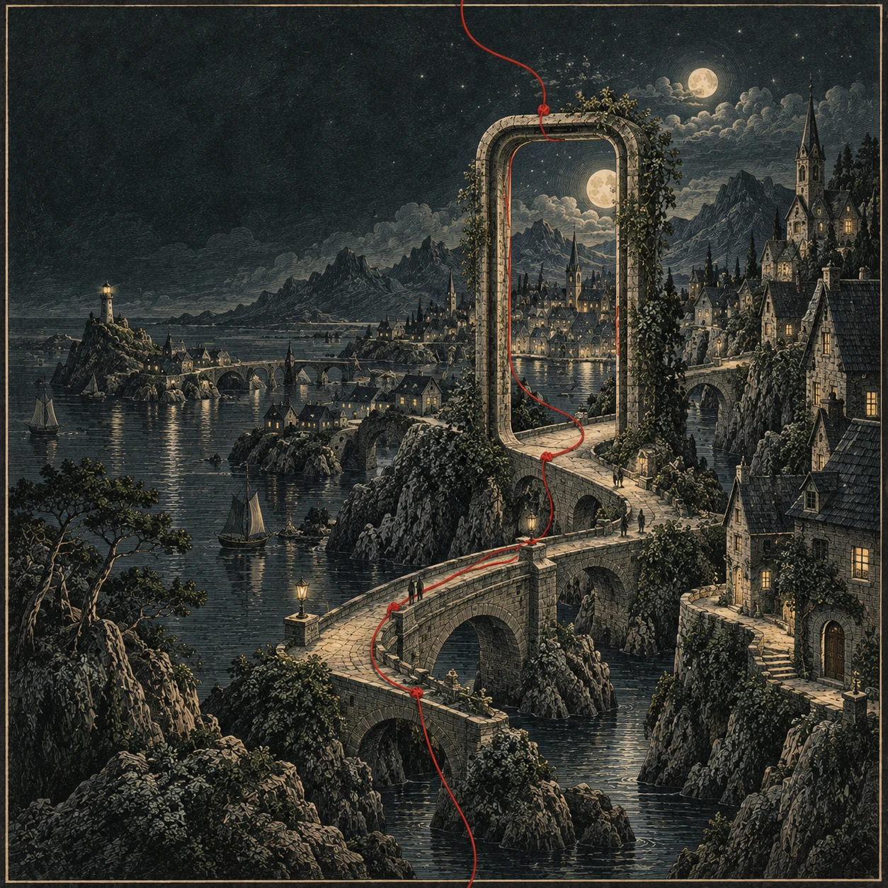

# Jacob Starheim — En rød tråd

En personlig portefølje der arbeid, utdanning og interesser møtes i et sammenhengende kunstgalleri. Seks gravyrpregede illustrasjoner bindes sammen av en rød tråd, med prosjektkort som forteller historiene underveis.

[Besøk nettsiden](https://jacobstarheim.vercel.app) · [Forhåndsvisning av arbeidsgrenen](https://jacobstarheim-git-codex-art-portfolio-jacobs-projects-deb8c182.vercel.app) · [LinkedIn](https://www.linkedin.com/in/jacob-vindal-starheim-9aa946325/)



## Om porteføljen

Nettsiden presenterer Jacob Vindal Starheims arbeid med mobilutvikling, brukeropplevelser og utforskende prosjekter. Innholdet er på norsk og fordelt på seks kapitler:

- **NIMMO:** arbeid med Flutter-appene Traveller og Driver, innlogging, tilgjengelighet og feilsøking.
- **Utdanning:** bachelor fra UiO, 30 studiepoeng enkeltemner på masternivå og pågående master ved USN. IN5320-prosjektet har en egen prosjektvisning.
- **Open BFME:** bidrag til åpne C++-prosjekter som rekonstruerer spillkode.
- **AIpodcast:** en prototype for spørsmål til podkaster med sporbare lydkilder.
- **Sjakk:** et analyseverktøy med motorintegrasjon og bildeimport av stillinger.
- **Om meg:** interesser, livet utenfor koden og kontaktlenker.

På desktop vises kunsten i full sidebredde med tekstkort oppå. På mobil flyttes kortene under bildene. «Bare kunsten» skjuler tekstlagene, og prosjektknappene åpner utdypende beskrivelser.

## Teknologi og tilgjengelighet

- Next.js 16, React 19 og TypeScript, med statisk eksport.
- Vanlig CSS, lokale Geist-fonter og responsive WebP-bilder.
- Native HTML-dialoger med tastaturbetjening, Escape-lukking og tilbakeføring av fokus.
- Hopp-til-innhold-lenke, synlige fokusmarkeringer, alternativ tekst og støtte for redusert bevegelse.
- Ingen database, backend-tjeneste eller API-nøkkel er nødvendig for å kjøre porteføljen. Kontaktlenkene går direkte til e-post, LinkedIn og GitHub.

## Kjør lokalt

Bruk Node.js 24 for å matche byggemiljøet på Vercel, samt npm. Klon standardgrenen `main`:

```sh
git clone https://github.com/JacobStarheim/Portfolio.git
cd Portfolio
npm ci
npm run dev
```

Åpne [localhost:3000](http://localhost:3000). Ingen `.env`-fil er nødvendig for lokal utvikling.

### Kommandoer

| Kommando | Formål |
| --- | --- |
| `npm run dev` | Start utviklingsserveren. |
| `npm run typecheck` | Kontroller TypeScript-typer. |
| `npm run lint` | Kjør ESLint uten tillatte advarsler. |
| `npm run build` | Lag et produksjonsbygg og eksporter til `out/`. |
| `npm start` | Server det ferdige bygget fra `out/` på port 3000. |

Kjør `npm run build` før `npm start`. Prosjektet bruker statisk eksport, så `next start` skal ikke brukes.

## Hvor innholdet ligger

- [src/components/portfolio.tsx](src/components/portfolio.tsx) — tekster, prosjektdetaljer, kontaktlenker, meny og dialoger.
- [src/styles/portfolio.css](src/styles/portfolio.css) — layout, kunstgalleri, tekstkort og mobilvisning.
- [src/app/globals.css](src/app/globals.css) — globale stiler, fokusmarkeringer og redusert bevegelse.
- [src/app/layout.tsx](src/app/layout.tsx) — språk, fonter og delingsmetadata.
- [public/art/](public/art/) — nettoptimaliserte illustrasjoner.
- [scripts/prepare-art.mjs](scripts/prepare-art.mjs) — størrelsestilpasning og WebP-komprimering.
- [docs/artwork-prompts.md](docs/artwork-prompts.md) — genereringsprompter for kunstbildene.

## Kunst og visuell retning

Illustrasjonene er AI-generert med OpenAIs bildeverktøy. Sjakkmotivet ble brukt som stilreferanse for resten av serien: mørke blågrønne toner, elfenbensfarget strek og en rød tråd gjennom alle kapitlene. Tekst og interaktive kort er HTML, ikke en del av bildene.

Visuell inspirasjon: [kind av Kengo Works](https://www.kengoworks.com/kind).

De ferdige WebP-bildene følger med repoet. Originale PNG-filer oppbevares separat og er bare nødvendige dersom nettversjonene skal genereres på nytt. Legg `nimmo.png`, `education.png`, `bfme.png`, `podcast.png`, `chess.png` og `about.png` i samme mappe, og kjør fra prosjektroten:

```sh
node scripts/prepare-art.mjs /absolutt/sti/til/originaler
```

Skriptet lager varianter med opptil 1254 og 640 piksler bredde i `public/art/`. Det endrer størrelse og komprimering, ikke motivene.

## Publisering med Vercel

Vercel-prosjektet `jacobstarheim` er koblet til dette GitHub-repoet. Automatisk bygging fra en push til arbeidsgrenen er verifisert.

- **`codex/art-portfolio`:** pushes bygger en forhåndsvisning på [arbeidsgrenens faste adresse](https://jacobstarheim-git-codex-art-portfolio-jacobs-projects-deb8c182.vercel.app).
- **`main`:** produksjonsgrenen. Pushes eller merges hit kan oppdatere [jacobstarheim.vercel.app](https://jacobstarheim.vercel.app).

Porteføljen og denne README-en ligger på `main`. Videre endringer gjøres på arbeidsgrener og gjennomgås i forhåndsvisning før de merges til produksjonsgrenen.

Vercel bygger fra kildekoden. `VERCEL_URL` brukes til delingsmetadata, og `VERCEL_ENV` styrer om siden kan indekseres: forhåndsvisninger og lokale bygg får `noindex`. Ikke last opp en lokal `out/` med localhost-metadata som et ferdig produksjonsbygg.

`.env*` og lokal Vercel-autentisering skal ikke legges i Git eller lastes opp som kildefiler. Se [verifikasjonsnotatene](docs/verification.md) for tester og oppsetthistorikk.

## Kontakt

[LinkedIn](https://www.linkedin.com/in/jacob-vindal-starheim-9aa946325/) · [GitHub](https://github.com/JacobStarheim) · [jacobvinstar@gmail.com](mailto:jacobvinstar@gmail.com)

## Lisens

Se [MIT-lisensen](LICENSE) som følger med repoet.
